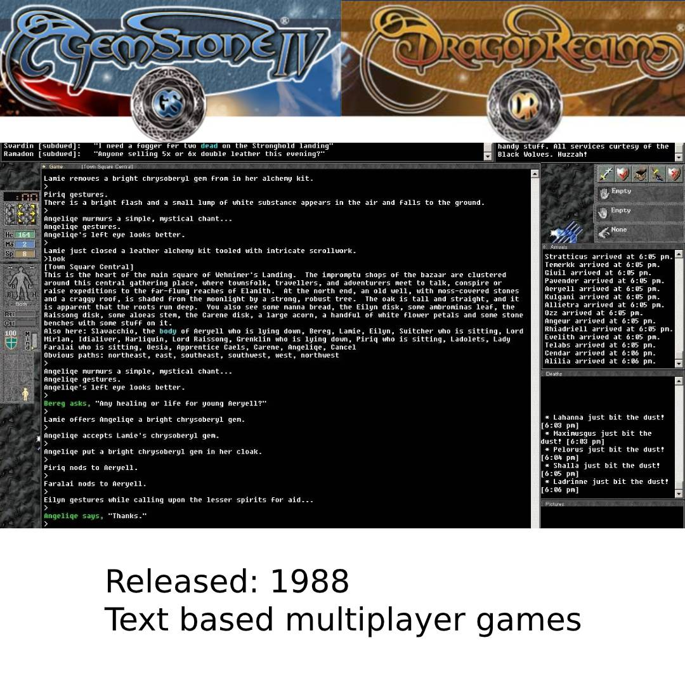
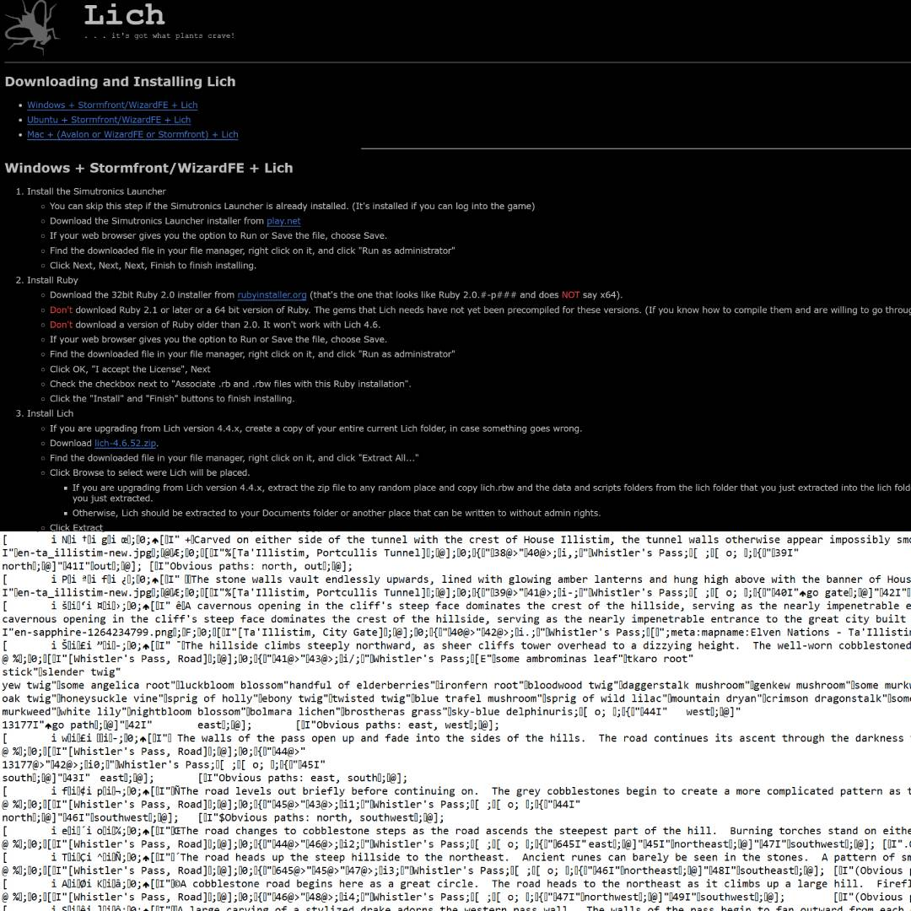
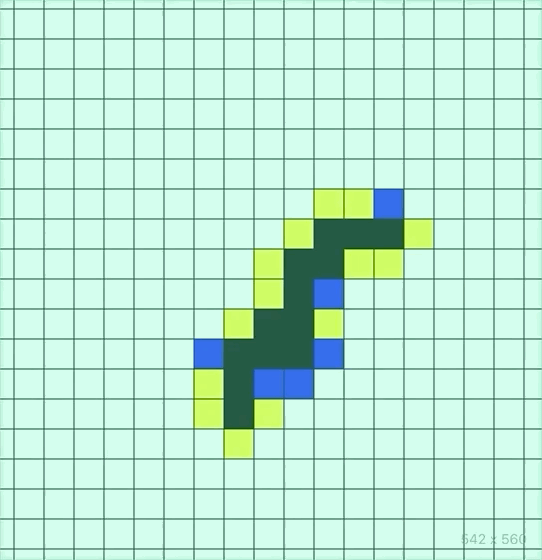

# Generative AI MUD

A procedurally generated M.U.D with events/locations generated from OpenAI's GPT-2 running on free services. Check it out [here](https://www.sommerval.com/gaim).

-----------
## Table of Contents

  - [How it's made](#how-its-made)
    - [Sources](#sources)
    - [Data Preprocessing](#data-preprocessing)
    - [Procedural Generation Algorithm](#procedural-generation-algorithm)
    - [Training](#training)
    - [Cloud Functions](#cloud-functions)
    - [Automation](#automation)
  - [Future plans](#future-plans)
  - [Issues](#issues)
  - [Built With](#built-with)
  - [Authors](#authors)
  - [Acknowledgments](#acknowledgments)

## How it's made

### Sources
  
M.U.D.'s are generally text-based and allow players to interact with the world or each other via natural language commands.

### Data Preprocessing
  
By downloading the ruby-based scripting engine "Lich" we are able to access .dat file used for automated navigation in GS and create a [script](https://github.com/marbilher/MUD_data_model/blob/master/raw_mapdb/parseMapDb.js) to clean the data. Similarly we are able to write a script to parse xml data from DR.

### Procedural Generation Algorithm
  
In order to prevent coordinate collisions when writing new locations to the database a test [script](https://github.com/marbilher/build-xy-map/blob/master/src/App.js) was created. Future modifications to how locations are added can be tested here before interacting with the database.

### Training
Training was done in a Collaboratory notebook with the help of Max Woolf's gpt-2-simple package, [here](https://github.com/minimaxir/gpt-2-simple).

### Cloud Functions
API end points for text generation were created via google cloud functions with the help of Max Woolf's gpt-2-cloud-run, [here](https://github.com/minimaxir/gpt-2-cloud-run).

### Automation
Automated generation of the world is handled via cronjob on an express server. Currently creating a handful of locations every 4 hours but capable of generating batches much more quickly.

## Future plans
* **Gamification (Building upwards)**
  * Allow users to input verb + noun commands at locations. Novel commands cost points but reward points when other users attempt the same commands. The best players will interact with the world in ways that make sense to other players. Will require persisting user data.
    * Example: Location (24, 45, 99) has a text description of "You see a dark castle." The user inputs "Enter the castle." A prompt is sent to the API endpoint and 30 seconds later a new layer of interactivity is added to that location. The user "enters" the castle and is rewarded with points and a new text description only accessible from that location. Future players that input the same prompt reward the original creator.
    * Reasoning: Text generation is slow via unpaid cloud functions. By rewarding players for creating new, natural layers of interactivity the world becomes alive in a natural and explorable way.

* **Clustered grouping**
  * Current location descriptions vary between coordinates in an inconsistent way.
    * By implementing sentiment analysis we can reduce locations down to sets of keywords like "interior" or "spooky" and implement a daily reshuffle algorithm that rebuilds the map with newly generated locations placed more naturally.

* **Multiplayer interactivity**
    * 2/3rds of the M.U.D is multi-user. By setting up a web-socket connection we can allow users to chat with each other.

## Issues
  * Text generation via unpaid servers is too slow. In it's current state we would expect someone to wait at least 30 seconds between every action. Work will be delayed until speeds improve.
  * Continuity in narrative is difficult to preserve. A user may enter a castle, then enter a door they found in the castle but, even with passing prior actions into the prompt, the other side of the door may be something entirely unrelated to their past actions in the castle.

## Built With

* [Lich](https://lichproject.org/) - Map script data
* [Gemstone](https://www.play.net/gs4/) - Source data for transformer model
* [Dragon Realms](https://www.play.net/dr/) - Source data for transformer model
* [simple-gpt-2](https://github.com/minimaxir/gpt-2-simple) - Cloud transformer training
* [gpt-2-cloud-run](https://github.com/minimaxir/gpt-2-cloud-run) - Dockerization and cloud function API endpoint package
* [AWS RDS](https://aws.amazon.com/rds/) - 20 gigabytes free MySQL storage
* [Google Cloud Functions](https://cloud.google.com/functions) - Free text generation (slow!)

## Authors

* **Marlon Bilbao Hernandez** - *Initial work* - [GAIM](https://www.sommerval.com/mud)

## Acknowledgments

* Thanks to all the brilliant people who created the tools I used on this project.

